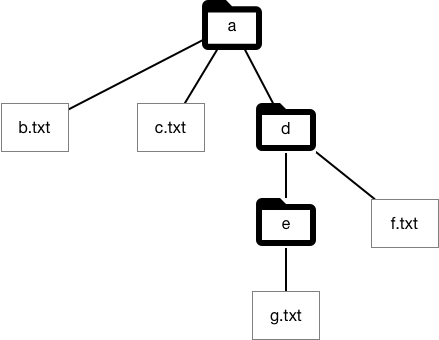
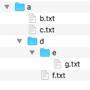
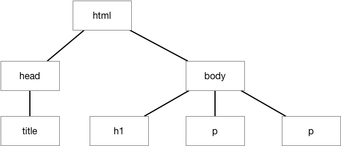
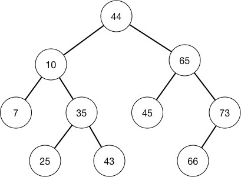

*****
Bomen
*****

Een belangrijke structuur die je overal in de informatica tegenkomt is de *boom*.
Dit is een *hiërarchische structuur* waarin de structuur van de delen gelijk is aan de structuur van het geheel,
zoals bij een boom in de natuur: een tak heeft dezelfde structuur als de boom.

Met behulp van een boom kun je een *hiërarchische structuur* weergeven.
Enkele voorbeelden hiervan: een hiërarchisch filesysteem, een tekst (bijvoorbeeld een verslag), een HTML-document.

Met behulp van een boom kun je ook efficiënt zoeken.
Een voorbeeld daarvan is een *binaire zoekboom*.

Met een *ontleedboom* maak je de syntactische structuur van een (lineaire) zin duidelijk.
Aan de hand van deze structuur bepaal je de betekenis van deze zin.
Voorbeelden hiervan komen we tegen bij natuurlijke talen, en bij *formele talen* zoals programmeertalen.

Voorbeeld: filesysteem
======================

Een voorbeeld van een boomstructuur is een hiërarchisch filesysteem,
zoals je dat bijvoorbeeld tegenkomt bij operating systems als Windows, OS X, en Linux.
In zo'n filesysteem is een bestand òf een "normaal" bestand, òf een map met bestanden.
Een bestand in een map kan dan ook zelf weer een map met bestanden zijn.

   Een hiërarchisch filesysteem

Met behulp van zo'n filesysteem kun je je bestanden op een logische manier organiseren,
bijvoorbeeld in een map per project.
De bestanden van een project kun je dan bijvooreeld weer onderverdelen in documentatie, broncode, projectadministratie, e.d.

  Vaak is het verdelen van bestanden in mappen niet voldoende om aan alle wensen voor het organiseren van gegevens te voldoen.
  Moderne filesystemen hebben daarvoor extra mogelijkheden, bijvoorbeeld in de vorm van labels.

.. todo::

  * (wortel)pad; padnaam (ook in URL)

Terminologie
============

Het beginpunt van de boom, bijvoorbeeld de map op het hoogste niveau, noemen we de wortel of *root*.
(In Linux spreek je over de *root directory*, aangegeven als ``/``.)

De bovenliggende map noem je de *ouder*-knoop: de *parent directory*.
Deze geef je aan als ``..``.

Omgekeerd noem je de onderliggende mappen (knopen) de kinderen: de *child directories*.

Een knoop(?) die geen kinderen heeft, zoals in dit voorbeeld een "normaal" bestand, noemen we een *blad*.

Een dergelijke boomstructuur wordt vaak getekend met de wortel van de boom bovenaan,
dus eigenlijk "op z'n kop".

   Een filesysteem als horizontale boom

Een andere manier om zo'n structuur weer te geven is *horizontaal*:
de wortel staat dan links boven, en de kinderen *ingesprongen* daaronder.
Soms is het mogelijk om een subboom in- en uit te klappen.

Merk op dat een map *leeg* kan zijn: deze bevat dan geen mappen of gewone bestanden.

Voorbeeld: HTML document
========================

De structuur van een HTML-document geef je weer met behulp van speciale symbolen: *tags*.

Deze tags komen meestal in (haakjes)paren: de inhoud van het element staat tussen deze haken.
Een tag heeft de vorm ``<tagname>`` (voor een openingshaak) of ``</tagname>`` (voor de bijbehorende sluithaak).

Voorbeeld van een een eenvoudig HTML-document:

.. code-block:: HTML

  <!doctype html>
  <html>
      <head>
          <title>Welcome</title>
      </head>
      <body>
          <h1>Welkom op mijn website</h1>
          
Dit is mijn eerste website

          
Hier moet nog meer tekst komen

      </body>
  </html>

Door middel van inspringen geven we de structuur van het document weer.
We kunnen dit ook tekenen als een boom:

   HTML-boom

**Opdracht**

Zoek voorbeelden van een horizontale weergave van een boom.
Let bijvoorbeeld op het gebruik van inspringen en in- en uitklappen.

**Opdracht**

Zoek uit wat een *outline editor* is (voor tekstdocumenten).
Welke mogelijkheden biedt de tekstverwerkingsprogramma's die je gebruikt om met de outline te werken?
(Bijvoorbeeld: navigeren; in- en uitklappen van tekst; reorganiseren: veranderen van de hiërarchie, verplaatsen van delen.)

De structuur van een HTML-document is bijvoorbeeld van belang bij het vormgeven hiervan in de browser.
Als je de opmaak van een knoop verandert, bijvoorbeeld de kleur of het lettertype,
verandert de opmaak van de hele bijbehorende subboom.
Anders gezegd: de kindknopen in de boom erven de vormgevingseigenschappen van de ouderknoop.
Dit is het "cascading" aspect van "cascading style sheets" (`CSS <https://nl.wikipedia.org/wiki/Cascading_Style_Sheets>`_).

Binaire zoekbomen
=================

Als we de elementen in een boom op een handige manier organiseren,
dan kunnen we hierin efficiënt zoeken.
(Vergelijk dit met het sorteren van de elementen van een rij (array).)

Elk element (knoop) in een binaire zoekboom heeft een waarde en een linker en een rechter subbomen;
een subboom kan leeg zijn (vgl. een lege map in een filesysteem).
Het *maximum* van de waarden in de linker subboom is kleiner dan de waarde in de knoop zelf;
het *minnimum* van de waarden in de rechter subboom is ten minste (``<=``) de waarde in de knoop zelf.

Voorbeeld van een binaire zoekboom:

   Binaire zoekboom

In een dergelijke boom kunnen we efficiënt zoeken, als bij binair zoeken in een rij (array):
als de waarde die je zoekt gelijk is aan de waarde in de wortel, dan ben je klaar;
als de waarde die je zoekt kleiner is dan de waarde in de wortel,
dan zoek je op dezelfde manier met de linker subboom als wortel;
als de waarde die je zoekt groter is dan de waarde in de wortel,
dan zoek je op dezelfde manier met de rechter subboom als wortel.

  Je krijgt op deze manier een pad van de wortel naar de uiteindelijke knoop met de gezochte waarde.
  Dit pad kun je ook gebruiken voor het identificeren van de plek van de knoop in de boom.
  (Vgl. ook het pad van een bestand in het filesysteem.)

* `visualisatie van een binaire zoekboom <http://btv.melezinek.cz/binary-search-tree.html>`_
* `Wikipedia: binaire zoekboom <https://nl.wikipedia.org/wiki/Binaire_zoekboom>`_

**Opdracht**

Schrijf de het pad op waarme je de knoop met waarde 33 vindt. Idem, met waarde 43.

**Opmerkingen**

* het zoekproces in een binaire zoekboom is alleen efficiënt als de boom redelijk *gebalanceerd* is:
  voor elke  subboom is dan het aantal knopen links en rechts ongeveer gelijk.
  De hoogte van de boom is dan ongeveer :math:`{^2}log(N)`, waarbij N het aantal knopen in de boom is.
  Voorbeeld: voor 1000 knopen is de hoogte dan ongeveer 10 (:math:`2^{10} = 1024`).

.. todo::

  * algoritmen op (binaire zoek)bomen; naast zoeken bijv. afdrukken in infix.

Ontleedbomen
============

   Ontleedboom van de expressie ``3 + 5 * x``
