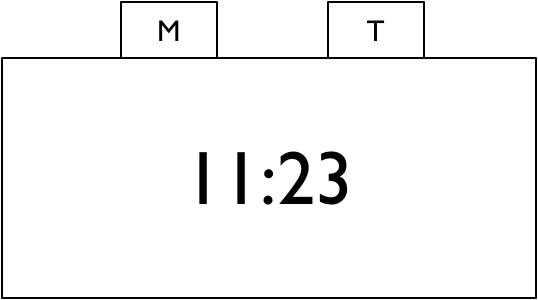
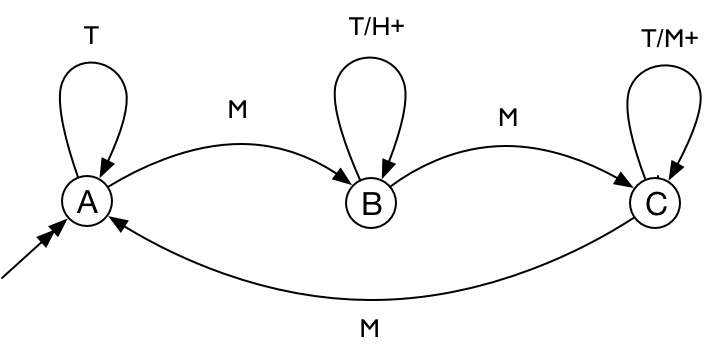
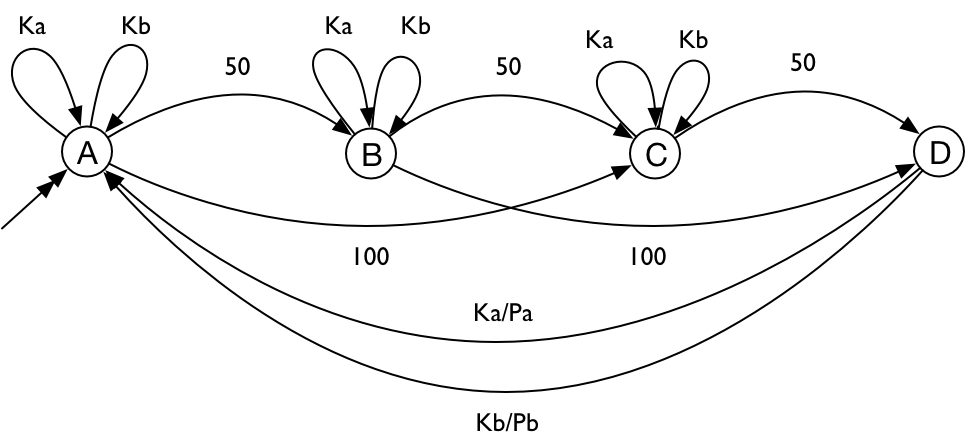

*****************
Eindige automaten
*****************

Beschouw het onderstaande apparaat: een klokje met twee knoppen, M (mode) en T (time).

   Figuur 1

Met deze twee knoppen kun je het klokje bedienen, op de volgende manier:

* het klokje kan in drie verschillende toestanden zijn:
    A) "run": het klokje loopt
    B) "hours": instellen van de uren;
       éénmaal indrukken van de knop T zet de tijd van het klokje 1 uur vooruit;
    C) "minutes": instellen van de minuten; met de knop T kun je de minuten vooruit zetten;
* elke keer indrukken van de knop M brengt het klokje in de volgende **toestand**: van A naar B naar C en weer naar A.

Voorbeeld: met de reeks MMTTTM zet je het klokje 3 minuten vooruit.

We kunnen het gedrag van het klokje ook weergeven in een figuur.
Een dergelijke figuur noemen we een *toestandsdiagram*.

   Figuur 2

In een toestandsdiagram:

* de cirkels stellen de toestanden van de automaat voor;
* de dubbele pijl geeft de begintoestand van de automaat aan;
* de enkele pijlen geven de toestandsovergangen aan:

    * in het label A/B bij een pijl is A het input-symbool en B het output-symbool
    * in het label A is A het input-symbool; er is geen output.

Het indrukken van de knop M komt overeen met het input-symbool M;
het indrukken van T met het input-symbool T.
Het output-symbool H+ geeft de actie om de uren één vooruit te zetten;
M+ zet de minuten één vooruit.

**Opdracht:** geef een reeks  waarmee je het klokje 3 uur vooruit zet.

**Opdracht:** bedenk nog een reeks om het klokje 3 uur vooruit te zetten.

**Opdracht:** geef de reeks waarmee je het klokje 1 uur achteruit zet.
(Het klokje gebruikt een 12-uurs systeem voor het weergeven van de tijd.)

Een dergelijke bediening komen we vaak tegen bij apparaten waarbij het lastig of duur is om veel knoppen te gebruiken.
Een berucht voorbeeld is de bediening van een magnetron.

De bediening van het klokje is een voorbeeld van een *eindige automaat*.
Een eindige automaat bestaat uit:

* een eindig aantal discrete toestanden;
    * één van deze toestanden is de *begintoestand*;
* een eindig aantal discrete input-symbolen;
* een eindig aantal discrete output-symbolen;
* een eindig aantal toestandsovergangen tussen deze toestanden,
  waarbij elke toestandsovergang gelabeld is met een input-symbool en een output-symbool.

Eindig en discreet wil hier eigenlijk hetzelfde zeggen als "digitaal": je kunt deze aftellen.
Anders gezegd: we kunnen de toestanden en de input- en output-symbolen benoemen met (verschillende) gehele getallen.
In plaats van getallen gebruiken we ook vaak letters of namen, maar dat maakt voor het principe niets uit.

.. note:: Toestand in de natuurkunde

  In de natuurkunde gebruik je ook het begrip toestand:
  de toestand van het zonnestelsel kun je bijvoorbeeld beschrijven met de snelheid en de positie van de verschillende planeten.
  Zowel de snelheid als de positie zijn continue waarden, geen discrete waarden: je kunt deze niet aftellen.
  We beschouwen het zonnestelsel dus niet als een eindige automaat.

Een dergelijke eindige automaat werkt op de volgende manier:

* de automaat begint in de begintoestand
* als de automaat in toestand S een inputsymbool A krijgt,
  en toestand S heeft een overgang gelabeld met A/B naar toestand T,
  dan:

     * geeft de automaat outputsymbool B, en
     * gaat de automaat over in toestand T

  Wat gebeurt er als er geen overgang is vanuit de huidige toestand voor het huidige inputsymbool?
  In principe kan de automaat dan van alles doen: je gebruikt deze op een manier waar deze niet voor gemaakt is.
  In onze voorbeelden gaan we ervan uit dat de automaat "crasht":
  deze gaat over naar de (impliciete) fouttoestand.
  Alleen een volledige reset (bijvoorbeeld stekker eruit) kan de automaat uit deze toestand halen.
  In de praktijk zul je dit proberen te voorkomen, door in elke toestand voor alle inputs een overgang te geven.

  Wat gebeurt er als er meerdere overgangen zijn die gelabeld zijn met hetzelfde inputsymbool A?
  Dan komen we in het gebied van de nondeterministische automaten;
  deze zullen we later bespreken.

Voorbeeld: snoepautomaat

Als volgende voorbeeld geven we een snoepautomaat. Deze heeft als invoer:
munten (50 cent en 100 cent) en keuzeknoppen (Ka en Kb).
Met een keuzeknop kun je een product kiezen: als je voldoende geld ingeworpen hebt, krijg je het gekozen product (Pa of Pb).
Als je nog onvoldoende geld ingeworpen hebt, doet de keuzeknop niets.
Deze snoepautomaat kunnen we beschijven met de volgende eindige automaat:

   Figuur 3

**Opdracht:** Ga na wat de betekenis is van de verschillende toestanden.

**Opdracht:** Het product Pb wordt duurder: het kost geen 150 cent maar 200 cent.
Pas de automaat aan voor deze prijsverhoging.

Eindige automaten komen we overal tegen in de informatica en de ICT:

* een computer bevat op het laagste niveau veel schakelingen die een eindige automaat voorstellen;
* een eindige automaat is een eenvoudig model voor een besturingsprogramma (bijvoorbeeld voor een Arduino);
* eindige automaten vormen een logisch/wiskundig model waarover we kunnen redeneren;
* de theorie van eindige automaten gebruiken we bijvoorbeeld voor het herkennen van *reguliere expressies*.

We behandelen in deze inleiding alleen een paar voorbeelden van eindige automaten voor besturingstoepassingen.
Eigenlijk zijn dit eenvoudige algoritmen: je hebt hiervoor geen programmeertaal nodig.

Voorbeelden:

* verkeerslicht
* herkennen van postcode
* berekenen van pariteit
* website

Websites en het web
===================

Je kunt een website ook opvatten als een eindige automaat:
de pagina's zijn de toestanden, en de verwijzingen zijn de toestandsovergangen.

Je kunt zelfs het hele web op deze manier als een eindige automaat beschouwen.
Je kunt dan proberen aan elke uitgaande link van een webpagina een waarschijnlijkheid toe te kennen.

Je kunt dan proberen een kans toe te kennen aan elke webpagina:
de kans dat iemand deze pagina bezoekt.

Op dezelfde manier kun je kansen toekennenn aan de toestandsovergangen:

Een dergelijke automaat waaraan je kansen toekent aan toestanden en aan toestandsovergangen heet wel een Markov-

Dit is het principe achter het oorspronkelijke algoritme van Google:

Digitale schakelingen
=====================

We kunnen een eindige automaat op een systematische manier omzetten in een digitale schakeling.
Als voorbeeld gebruiken we de snoepautomaat.

Een eindige automaat als digitale schakeling ziet er als volgt uit:

Hierin is F een functie die afhangt van de toestand en het inputsymbool;
deze levert als resultaat twee waarden: de nieuwe toestand en het outputsymbool.
We kunnen deze functie F maken als "random logic";
een andere eenvoudige en universele manier is om hiervoor een geheugen (read-only memory, ROM) te gebruiken.
Dit geheugen bevat dan een opsomming van de waarden van de functie voor de verschillende inputwaarden:
deze inputwaarden gebruiken we als adres om toegang te krijgen tot de opgeslagen functiewaarde.

Het geheugen moeten we dan eenmalig programmeren met de waarden uit de functietabel

De eerste stap is om een tabel te maken voor de toestandsovergangen:

input x toestand => output x toestand

We nummeren de toestanden, de inputsymbolen en de outputsymbolen.
